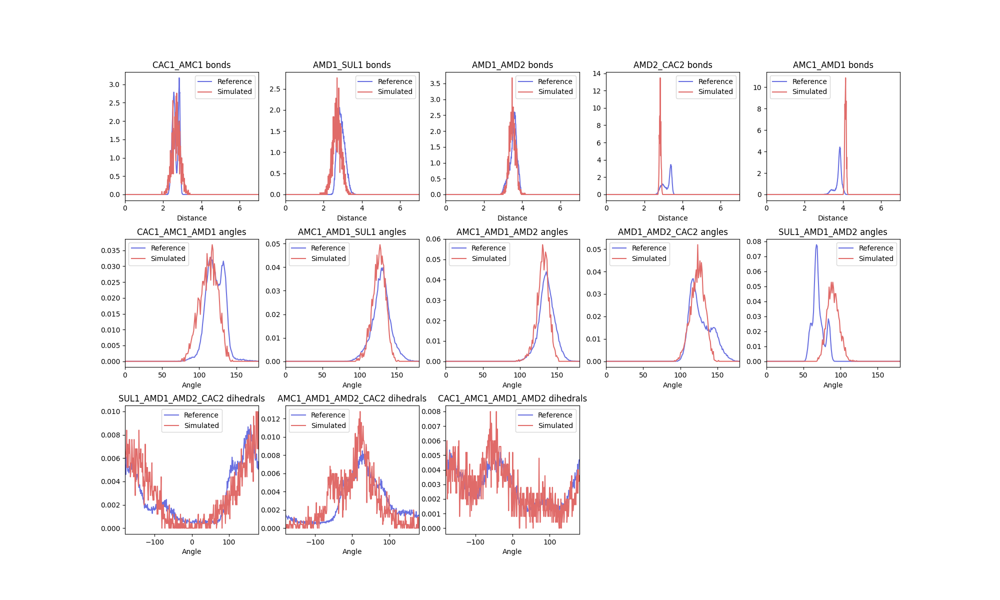
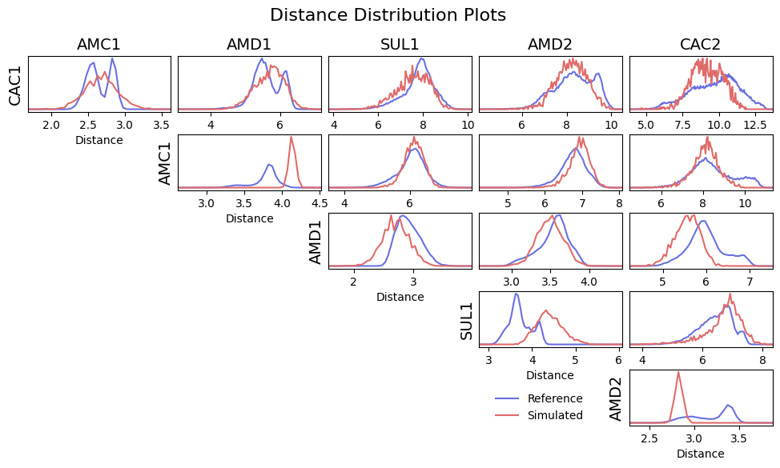
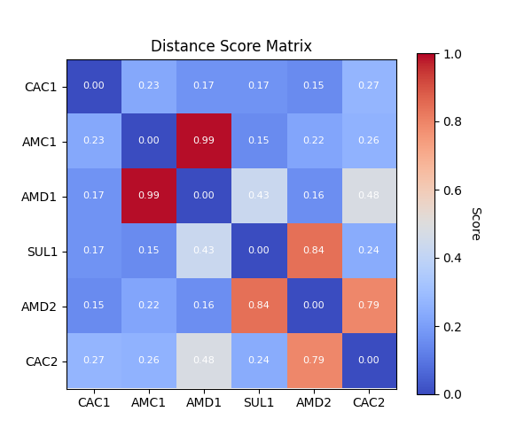

``ff_assess``
*************

Background
==========

``ff_assess`` is the model assessment subprogram of Fast-Forward. Once you have generated a
model using ``ff_inter``, and performed a test simulation using your new coarse grained model,
``ff_assess`` can be used to validate how faithful your model is to the pseudo-atomistic
reference is was generated from. In short, ``ff_assess`` is designed to compare the reference
distributions used to generate the new coarse grained topology to what was actually simulated.

Options
=======

.. code-block:: none

    -f TRAJFILE           simulated trajectory file (default: None)
    -s TPRFILE            simulated tpr file (default: None)
    -i [ITP_FILES ...]    itp file (default: None)
    -d REFERENCE          Path to directory with reference distributions (default: None)
    -plots [PLOTS]        Make plots comparing distributions. Optionally provide a path (default: current dir) (default:
                      None)
    -outliers             exclude outliers from overall score (default: False)
    -plot-data            save data for making plots as single pickle file (default: False)
    -score-weight HELLINGER_WEIGHT
                      weight of the Hellinger distance in the distance score (default: 0.7)
    -include-constraints  fully include constrained distances in the distance score score calculation (default: False)
    -dists                Save text files with time series and distribution data for interactions (default: False)

Example
=======

The simulated trajectory of a new model of a molecule could be assessed like so:

.. code-block::

    ff_assess -f vis.xtc -s vis.tpr -i molecule.itp -d /path/to/reference/files/ -plots

.. note::

    For a single molecule, it is usually sensible to extract the trajectory of only the molecule beforehand,
    and correct it for pbc artifacts using Gromacs. For example:

    .. code-block:: none

        gmx trjconv -f trajectory.xtc -s topology.tpr -pbc mol -center -o vis.xtc
        gmx trjconv -f trajectory.xtc -s topology.tpr -pbc mol -center -o vis.gro -e 0

    The ``vis.gro`` can also be used to generate the topology of the solvent-free system using ``gmx grompp`` and
    an appropriate topology file

In the ``ff_assess`` command given above, the topology and trajectory are now a "real" simulated trajectory of
some molecule in the process of being parameterised.

In addition to the new topology and trajectory, ``ff_assess`` also requires the model itp used, and the files
generated by ``ff_inter`` containing the distribution information, indicated by `-i` and `-d` respectively.
The interactions annotated in the itp will be assessed against their reference distributions, and a warning
is issued if the relevant files cannot be found.

What is the subprogram actually doing?
=============================================

``ff_assess`` works in three steps:

    1.  Find interactions annotated in the input itp file
    2.  Generate distributions of the annotated interaction as were actually simulated in the input trajectory
    3.  Perform statistical tests comparing the simulated and reference distributions. Plot comparisons and
        generate reports.

Principally, ``ff_assess`` is calculating a score using the `Hellinger distance <https://en.wikipedia.org/wiki/Hellinger_distance>`_
between the two distributions. For two discrete probability distributions, `P` and `Q`, the distance is defined by:

.. math::
     H(P,Q) = \frac{1}{\sqrt{2}}\sqrt{\sum_{i=1}^k (\sqrt{p_i} - \sqrt{q_i} )^2}

`H(P,Q)` is then a score in the interval [0,1], with 0 indicating a perfect match and 1 indicating no overlap between
the two distributions. Fast forward also calculates a modified value using an additional term
to ensure agreement in the mean, as well as overall similarity between distributions. The extent of this contribution
is controlled by the ``score-weight`` flag in ``ff_assess``. By default, the native Hellinger distance is weighted
70% with a 30% contribution from the correction.

Interaction assessment
======================

The first comparison that ``ff_assess`` makes is between bonded distributions as annotated in the molecular
topology. This results in a figure comparing the two distributions:

As well as a report with the scoring function:

.. code-block::

     [ Interaction Distribution Report ]
       Overall Score : 0.39 ± 0.08

     Interaction Scores:
     0 - identical, 1 - no overlap

     Score guide:
       0.0-0.3 : good
       0.3-0.5 : ok
       0.5-1.0 : bad

            Hellinger distance (Scoring function)

     bonds
        CAC1_AMC1           : 0.33 (0.25)
        AMD1_SUL1           : 0.41 (0.45)
        AMD1_AMD2           : 0.20 (0.17)
     ...

As described above, the report contains both the Hellinger distance and the modified scoring function scores
for each distribution annotated. Similar to ``ff_inter``, the ``-plot-data`` flag can be used for the subprogram to
also write out the raw data for the plots so that it can be replotted as desired. The report and plots can be
used to indicate where further optimisation of the model could be targeted. The overall score, calculated as the
mean of all the individual scores, could be used to report a single value for the fidelity of the model.

Distance distribution assessment
================================

To ensure good conformational sampling by the new model, ``ff_assess`` also generates distribution comparisons for
intramolecular distances in the newly simulated trajectory against their references. Distance scoring can be used
to indicate where interactions are missing from the model. In further optimisation, these interactions could be
introduced to better reproduce the molecular conformational ensemble. Where constraints are present in the system
(as in the AMD1-AMC1 bead distance shown below), this may result in distance distributions that are not possible to
resolve, and therefore result in high scores. For this reason, distances between constraints are normally excluded
from the overall score reported at the top of the written report. To include them, the ``-include-constraints``
flag can be used.

As before, a distribution comparison figure is generated, comparing the reference intramolecular distances to
the newly simulated ones:

The modified scoring function only is used to generate a scoring matrix:

The scoring matrix is also saved as a report:

.. code-block::

     [ Distance Distribution Report for GSH ]
      Overall Score : 0.37 ± 0.05

       Max Score : 0.99

     Score guide:
       0.0-0.3 : good
       0.3-0.5 : ok
       0.5-1.0 : bad

       Score Matrix:
     0 - identical, 1 - no overlap

           CAC1  AMC1  AMD1  SUL1  AMD2  CAC2
     CAC1  0.00  0.23  0.17  0.17  0.15  0.27
     AMC1  0.23  0.00  0.99  0.15  0.22  0.26
     AMD1  0.17  0.99  0.00  0.43  0.16  0.48
     SUL1  0.17  0.15  0.43  0.00  0.84  0.24
     AMD2  0.15  0.22  0.16  0.84  0.00  0.79
     CAC2  0.27  0.26  0.48  0.24  0.79  0.00

