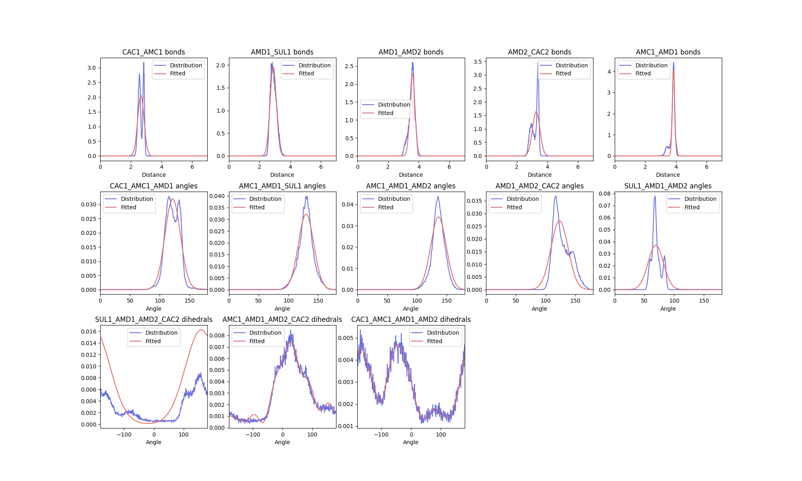

``ff_inter``
*************

Background
==========

To parameterise a molecule for the Martini force field, effective interactions between
beads need to be converted from the underlying mapped interactions between groups of atoms.
This can be achieved in fast forward using the ``ff_inter`` program, which takes a
mapped trajectory together with a topology file describing the system to calculate
the distributions of the interactions.

Options
=======

``ff_inter`` has the following options:

.. code-block:: none

  -f TRAJFILE           trajectory file (default: None)
  -s TPRFILE            tpr file (default: None)
  -n NDX_FILE           index file (default: None)
  -pref PREFIX          common prefix to filename (default: )
  -i [ITP_FILES ...]    itp file (default: None)
  -dists [DISTRIBUTION_DATA]
                        Save text files with time series and distribution data for interactions. Optionally provide a
                        path (default: current dir). (default: None)
  -plots [PLOTS]        Plot the reference and fits of bonded interactions. Optionally provide a path (default: current
                        dir). (default: None)
  -plot-data            Save a pickle file containing the input data for the plots (default: False)
  -constraints CONSTRAINT_CONVERT
                        Force constant above which to convert bonds to constraints (default: 10000)
  -temperature TEMPERATURE
                        Temperature to use in Boltzmann inversion (default: 310)
  -precision PRECISION  Precision of variables written to itp (default: 3)
  -max-dihedral MAX_DIHEDRAL
                        Maximum multiplicity of dihedral to try stacking during dihedral fitting (default: 10)
  -dihedral-scaling DIHEDRAL_SCALING
                        Scale factor for strength of proper dihedral terms from fit to potential (default: 1000.0)
  -itp-mode [{None,comments,all}]
                        Use only interactions written into itp already. Will use only commented interactions by
                        default, or all interactions if 'all' is specified. (default: None)
  -dist-matrix          Save text files with time series and distribution data for all pairwise bead distances
                        (default: False)
  -lincs                Estimate the LINCS order required for solving the constraints in the molecule(s) (default:
                        False)

Example
=======

.. code-block::

    ff_inter -f mapped.xtc -s mapped.tpr -i molecule.itp -itp-mode comments -dists -dist-matrix -plots -lincs

In the above command, the ``ff_inter`` subprogram takes the mapped/pseudo-atomistic system described by ``mapped.tpr``
and ``mapped.xtc``, and interrogates the bonded interactions of the molecule described by ``molecule.itp``. On
completion, the subprogram will write out a new itp file (backing up the input one), with bonded parameters
derived from fittings to the interaction distributions in the input trajectory.

.. note::
    **What is an interaction and what do we mean by interrogating it?**

    Consider two coarse grained beads in the mapped trajectory that have a chemical bond between them in the
    coarse grained topology. A fundamental question for parameterising the molecule is `How far away are these
    two beads from each other, and so how long is the bond between them? How stiff should the resultant bond
    be?` One can extend this for further groups of three or four atoms with bonds between them, and ask the same
    question for angle and dihedral potentials in a coarse grained topology.

    By indicating that we want to investigate these interactions in the input topology file, we tell the ``ff_inter``
    subprogram to firstly generate time series data of these sets of beads, and then fit to time-averaged distributions,

By using the `comments` mode of the ``-itp-mode`` flag, only the interactions which have been specified by the
comments in the given itp file will be investigated and modified. More details and further options for this flag are
given below.

The ``-dists`` and ``-dist-matrix`` flags ensure that ``.dat`` files are written out for each interaction and
inter-bead distance in the molecule. These files are designed to be compatible later with the ``ff_assess`` subprogram.
Both the time series data file, and a time-averaged distribution of the data are written.

The ``-plots`` flag generates a plot of the time-averaged interaction distributions, also showing how the subprogram has
fitted them. This may be useful for debugging poorly-fitted parameters during later optimisation.

Of these options, the trajectory, topology, and itp files are strictly necessary.
Other options are described below.

itp file format
===============

Denoting interactions
----------------------

Interactions can be computed from one or multiple itp files. The molecule name
is simply matched to those found in the tpr and trajectory file and then the
interactions are computed for all commented interactions. For example, from the
following entry the first two bonds are put in a group and computed together and
the last bond is skipped.

.. code-block:: none

    [ bonds ]
    1 2 1 2000 ; group1
    2 3 1 2000 ; group1
    4 5 1 1000

Minimal itp files
-----------------

``ff_inter`` can generate all interactions implicitly from minimal itp files describing only
atoms and bonds. This may be useful for parameterising a single molecule. In this case, the
input itp file can look like:

.. code-block:: none

    [ moleculetype ]
    MOL     1

    [ atoms ]
    1 TYPE 1 RESNAME ATOMNAMEa 1
    2 TYPE 1 RESNAME ATOMNAMEb 2
    3 TYPE 1 RESNAME ATOMNAMEc 3
    4 TYPE 1 RESNAME ATOMNAMEd 4

    [ bonds ]
    1 2 1 0.1 10000 ; ATOMNAMEa_ATOMNAMEb
    2 3 1 0.1 10000 ; ATOMNAMEb_ATOMNAMEc
    2 4 1 0.1 10000 ; ATOMNAMEb_ATOMNAMEd
    3 4 1 0.1 10000 ; ATOMNAMEc_ATOMNAMEd

From a mapped trajectory for this molecule, ``ff_inter`` will write a new itp file for the
molecule containing fitted bonded parameters not only for bonds, but also for angles
and dihedrals that it automatically identifies resulting from the molecular graph.

File writing
------------

``ff_inter`` preserves existing itp files with identical names through safe file backups.

Distributions and plotting
===========================

Saving files
------------

``ff_inter`` computes time series and resulting distributions for input molecular topologies
for the interactions specified in itps. To save the text files, figures of fitted
distributions, and the data used for plotting, the ``-dists``, ``-dist-matrix``, ``-plots`` and ``-plot-data``
arguments can be used respectively. If the ``-prefix`` argument is given, it is used for
all file names in the output.

Two kinds of distribution files are written, designed in part for subsequent use with ``ff_assess``.

Plots
-----

The figure shown is an example of a distribution plot generated by ``ff_inter``. Each subplot
has a title corresponding to interaction type and the atoms involved. For each interaction
in the plot, the raw data (in blue) is plotted along with the fitted distribution (in red).

Plot data
----------

The plot data is saved as a pickle file. The pickle file contains a nested dictionary of
all the data required to generate the output plot, for users' own analysis and use.
The dictionary is structured to group individual interactions by their interaction type.
Each entry contains items to reproduce the plot, as well as basic fitting information. For
example, the angle entry shown below contains the arrays of the mapped distribution (``Angle``
and ``simulated_distribution``), as well as the fitted distribution determined by ``ff_inter``
(``fitted_distribution``). Finally it contains entries for the center and sigma
(``distribution_center`` and ``distribution_sigma``) of the fitted distribution used to
determine the parameters in the output itp file.

.. code-block:: none

    {
        "angles":{
            "ATOMNAMEa_ATOMNAMEb_ATOMNAMEc":
            {
                "Angle": [0.5, 1.5, 2.5, ... ],
                "distribution_center": 80.173,
                "distribution_sigma": 12.99018238723656,
                "fitted_distribution": [2.0831593372894023e-10, 3.330336459711729e-10, 5.292733885907642e-10, ... ],
                "simulated_distribution": [0.0, 0.0, 0.0, ...]
            },
            "ATOMNAMEb_ATOMNAMEc_ATOMNAMEd":
            {
                "Angle": [0.5, 1.5, 2.5, ... ],
                ...
            }
            ...
        }
        "bonds":{...}
        ...
    }

Dihedral fitting
================

One of the powerful features of ``ff_inter`` is the fitting of multiple functions to mapped
dihedral distributions. ``ff_inter`` will fit dihedrals of various multiplicities to fit
the underlying distributions to fit the form of `proper dihedral used by gromacs
<https://manual.gromacs.org/2024.4/reference-manual/functions/bonded-interactions.html#proper-dihedrals-periodic-type>`_.

``ff_inter`` will further try to discriminate between dihedrals of proper and improper types.
Based on fitting statistics, it will use either a series of increasing multiplicity
dihedrals or a gaussian function to fit the underlying data and determine the correct
output parameters for an itp file.

caveat emptor
-------------
While fitting multiple dihedrals may result in a faithful theoretical reproduction of
mapped dihedral distributions, it may not result in a production-stable molecule. The
``-max-dihedral`` and ``-dihedral-scaling`` arguments may be useful to optimise a
molecule topology for these purposes.

By default, ``ff_inter`` will attempt to fit up to 10 dihedrals of increasing multiplicities
in order to best match the underlying mapped dihedral distribution:

.. math::

 V_d(\phi_{ijkl}) = \sum_{n=1}^{\textit{max_dihedral} = 10} k_n(1+ cos(n\phi - \phi_{0,n}))

With the ``-max-dihedral`` argument, the maximum number of contributing functions can be limited
to a value as indicated in the sum. While the fitted distribution may not result in as
faithful a match, it may improve the stability of a molecule for simulation purposes.

The ``-dihedral-scaling`` argument may be similarly useful in preparing stable molecules. The
values of :math:`k_n` in the above description of the final function may be sufficiently
weak as to have little-to-no effect on the dihedral distribution during simulation. Therefore,
these factors are scaled by a fixed value when written to itp files. Nominally, this is 1000,
but this can be changed using the ``-dihedral-scaling`` argument.

Constraints
============

If the force constant of a bond is very high, it is usually better to convert it to
a `constraint <https://manual.gromacs.org/documentation/current/reference-manual/algorithms/constraint-algorithms.html>`_.
``ff_inter`` sets this value to be 10,000 kJ/mol/nm^2 by default, but this can be changed using
the ``-constraints`` argument. The ``-lincs`` argument can also be used to estimate the LINCS order for solving the
constraints during the simulation.

